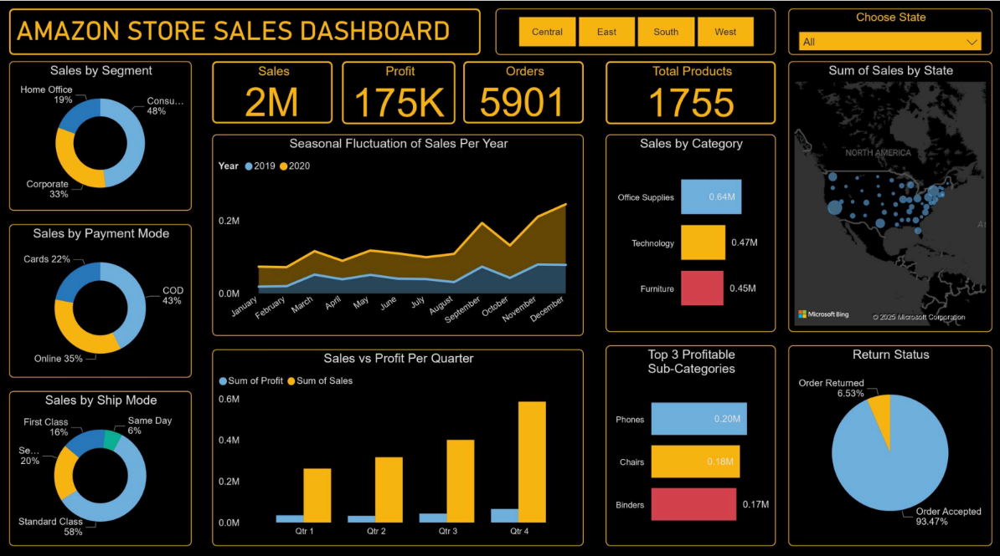

# 📊 Amazon Store Sales Dashboard (AI-Powered)

An end-to-end **Data Analytics & Business Intelligence project** built using **Power BI and AI tools** to analyze Amazon store sales, uncover hidden insights, and support data-driven decision-making.

---

## 📑 Table of Contents

- [Project Overview](#-project-overview)
- [Business Problem](#-business-problem)
- [Tools & Technologies](#-tools--technologies)
- [Dataset Overview](#-dataset-overview)
- [Key KPIs Tracked](#-key-kpis-tracked)
- [Dashboard Features](#-dashboard-features)
- [Key Insights](#-key-insights)
- [Business Recommendations](#-business-recommendations)
- [Dashboard Preview](#-dashboard-preview)
- [What I Learned](#-what-i-learned)
- [Author & Contact](#-author--contact)

---

## 🚀 Project Overview

This project focuses on analyzing Amazon Store sales data to identify:
- Revenue and profit trends
- High-performing and underperforming categories
- Seasonal sales patterns
- Customer segment and regional performance

The final output is an **interactive Power BI dashboard** designed for leadership and business stakeholders.

---

## 🧠 Business Problem

Amazon was experiencing:
- Uneven growth across product categories and regions  
- Profit not increasing proportionally with sales  
- Hidden inefficiencies in certain segments  

The goal was to **diagnose root causes**, surface **actionable insights**, and enable **strategic clarity**.

---

## 🛠 Tools & Technologies

- **Power BI** – Data modeling, DAX, and dashboard creation  
- **Claude AI** – Dataset exploration and quick insight generation  
- **Data Squirrel / Julius** – AI-assisted analytics  
- **Excel / CSV** – Raw dataset  
- **Gamma.app** – Presentation and storytelling  

---

## 📂 Dataset Overview

- ~5,900+ transactions  
- Multiple years of sales data  
- Key fields:
  - Sales
  - Profit
  - Category & Sub-Category
  - Region & State
  - Customer Segment
  - Ship Mode
  - Payment Mode
  - Return Status

---

## 📈 Key KPIs Tracked

- Total Sales  
- Total Profit  
- Profit Margin  
- Total Orders  
- Total Products  
- Return Rate  
- Average Order Value  

---

## 📊 Dashboard Features

- KPI cards for quick performance overview  
- Sales by Category & Sub-Category analysis  
- Seasonal sales trend (monthly & yearly)  
- Sales vs Profit comparison by quarter  
- Regional & state-wise sales analysis  
- Customer segment, ship mode & payment mode breakdown  
- Interactive slicers for region and state filtering  

---

## 🔍 Key Insights

- 📌 **Technology** category has the highest profit margin  
- ⚠ **Furniture** shows strong sales but very low profitability  
- 📈 Sales peak during **Q4 (Oct–Dec)** indicating seasonality  
- 🧑 **Consumer segment** contributes the largest share of revenue  
- 📦 Return rate is ~6.5%, with scope for optimization  

---

## 💡 Business Recommendations

- Improve pricing and supply chain efficiency for Furniture  
- Focus marketing and inventory on high-margin Technology products  
- Leverage Q4 seasonality with targeted campaigns  
- Reduce return rates through better product descriptions and logistics  

---

## 📸 Dashboard Preview

---

## 🎯 What I Learned

- How to translate business problems into analytical questions  
- Using AI tools to speed up dataset understanding  
- Building executive-ready dashboards in Power BI  
- Turning raw data into actionable business insights  

---

## 🙋 About Me

Aspiring Data Analyst with hands-on experience in **Power BI, SQL, Excel, and AI-assisted analytics**.  
Passionate about solving real-world business problems using data.

---

## 👤 Author & Contact

**Jayesh Kamble**  
**Data Analyst**

📧 **Email:** [jayeshbkamble@gmail.com](mailto:jayeshbkamble@gmail.com)  
🔗 [LinkedIn](https://www.linkedin.com/in/jayeshbkamble)

---

💬 Feel free to connect with me for collaboration, feedback, or data analytics opportunities.

⭐ If you find this project useful, please **star the repository**!
